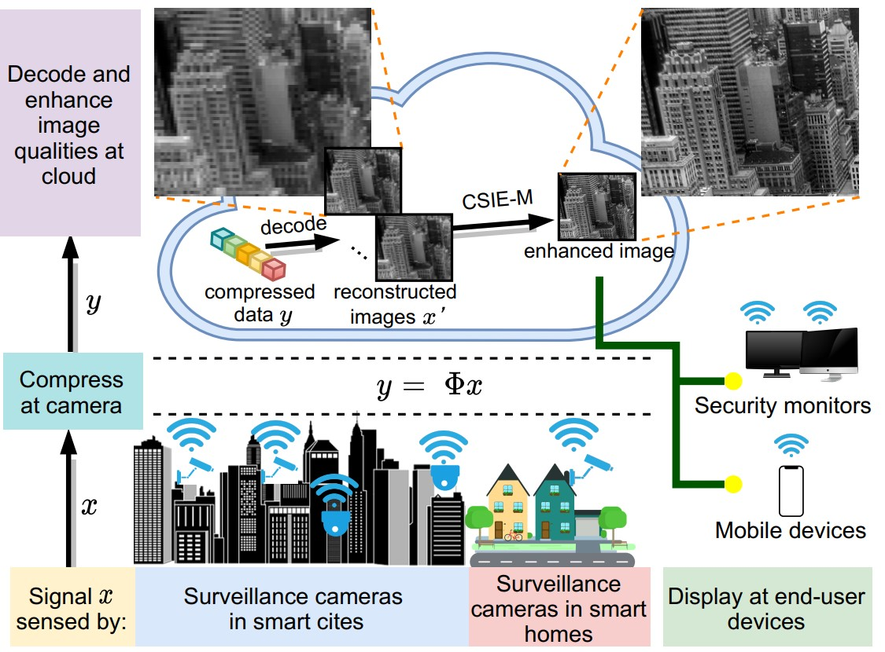
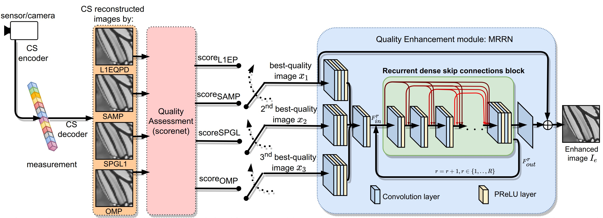
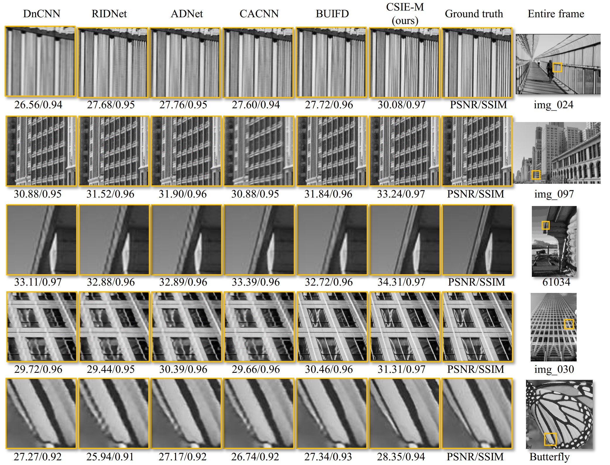

# CSIE-M: Compressive Sensing Image Enhancement Using Multiple Reconstructed Signals for Internet of Things Surveillance Systems [[paper]](https://ieeexplore.ieee.org/document/9437957)

Bibtex:

```latex
@ARTICLE{9437957,
  author={Pham, Chi Do-Kim and Yang, Jian and Zhou, Jinjia},
  journal={IEEE Transactions on Industrial Informatics}, 
  title={CSIE-M: Compressive Sensing Image Enhancement Using Multiple Reconstructed Signals for Internet of Things Surveillance Systems}, 
  year={2022},
  volume={18},
  number={2},
  pages={1271-1281},
  doi={10.1109/TII.2021.3082498}
  }
```

The code is developed by [AcidHimKoPhim](https://github.com/AcidHimKoPhim) based on [SRFBN](https://github.com/Paper99/SRFBN_CVPR19) tested on Ubuntu 16.04/18.04 environment (Python 2.7, PyTorch 0.4.0/1.0.0/1.0.1, CUDA 8.0/9.1) with Tesla V100 GPUs.



The proposed CSIE-M in IoT surveillance system.



The proposed CSIE-M architecture. Sensed signal is compressed by CS in cameras. At the decoder, compressed data (measurement) is recovered by different CS reconstruction algorithms. Reconstructed images are judged by the No-reference quality assessment module Scorenet and fed to the quality enhancement network MRRN by order of quality scores for producing the enhanced image

## Contents
1. [Requirements](#Requirements)
2. [Results](#results)
3. [Acknowledgements](#acknowledgements)

## Requirements
- cv2 (pip install opencv-python)
- imageio 2.6
- Pandas 0.23
- Python 2.7 (Anaconda is recommended)
- PyTorch (Pytorch version >=0.4.1 is recommended)
- Torchvision 0.1.8
- tqdm 4.36


#### Quick start

1. Clone this repository:

   ```shell
   git clone https://github.com/AcidHimKoPhim/CSIE-M.git
   ```

2. Run quality enhancement by:

  ```shell
  cd CSIE-M/
  bash runtest<sampling rate>.sh
  ```
  
where `sampling rate` in {0.125, 0.25, 0.5, 0.75}

## Results

#### Quantitative Results



Qualitative comparison on Set5, BSD200, and Urban100.


## Acknowledgements
- We would like to thank [Xhen Li](https://github.com/Paper99) and [Jinglei Yang](https://github.com/penguin1214). Our code structure is based on their repository of [SRFBN](https://github.com/Paper99/SRFBN_CVPR19).
